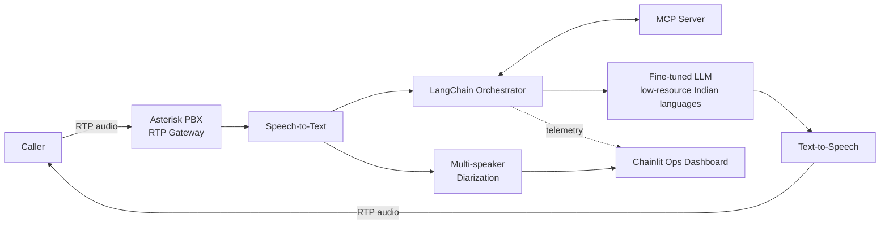

<h2 align="center">Pooja Bhavsar</h2>

  <b>AI/ML Engineer &nbsp;·&nbsp; Generative AI &nbsp;·&nbsp; Agentic Systems &nbsp;·&nbsp; MLOps</b> 
  Ex-AI/ML Developer @ Sterlite Technologies &nbsp;|&nbsp; Ex-ISRO Space Applications Centre

  &nbsp;
  &nbsp;
  &nbsp;
  

---

### I ship production AI, not notebooks.

2.5+ years building and deploying ML, NLP, and Agentic AI systems in production — real-time MLOps pipelines, LLM-powered IVR and chatbot platforms, multi-agent orchestration, and RAG architectures at enterprise scale.

- Architected a production **Agentic AI IVR platform** — Asterisk, RTP gateway, MCP Server, LangChain-based LLM responses, STT/TTS, multi-speaker diarization, fine-tuned for low-resource Indian languages
- Built a **real-time RAG + sentiment pipeline** serving 1,000+ daily interactions with sub-second retrieval
- Designed ML classification systems processing **50,000+ DNS log entries/session** for cyber threat detection (ISRO Space Applications Centre)
- Open-sourced ML projects hitting **95%** (DGA domain detection) and **98.5%** (plant disease CNN) accuracy

 

  
  
  
  

---

## Production Work

<table>
<tr>
<td width="50%" valign="top">

### Agentic AI IVR Platform
**Multi-agent · Voice-native · Multilingual**

End-to-end voice AI system: Asterisk + RTP gateway, MCP Server, LangChain-orchestrated LLM responses, Chainlit UI, STT/TTS, multi-speaker diarization. LLMs fine-tuned for low-resource Indian languages. Cut call-handling latency from seconds to milliseconds in production.

`LangChain` `MCP Server` `Asterisk` `Chainlit` `Hugging Face` `Docker`

</td>
<td width="50%" valign="top">

### Real-Time RAG & Sentiment Engine
**1,000+ daily interactions · Sub-second retrieval**

Production RAG pipeline (LangChain + Hugging Face) powering live Q&A and post-call transcription, with NLP-driven sentiment analysis layered across every interaction for omnichannel customer engagement.

`LangChain` `Hugging Face` `NLP` `Docker` `Multi-tenant`

</td>
</tr>
</table>

### System Design Snapshot — Agentic AI IVR Platform

---

## Featured Projects

<table>
<tr>
<td width="50%" valign="top">

### DGA Domain Detection
**95% accuracy · 100K+ DNS queries · 1,000 req/sec**

Random Forest & Gradient Boosting on real-time Zeek network data, streamed via Apache Kafka and served through FastAPI + Docker on AWS.

`Python` `Scikit-learn` `Kafka` `FastAPI` `Docker` `AWS`

[→ View repo](https://github.com/poojabhavsar28/dga-domain-detection)

</td>
<td width="50%" valign="top">

### Plant Disease Detection CNN
**98.5% accuracy · PyTorch from scratch**

CNN trained on 10K+ augmented images over 50 epochs; +12% over baseline via focal loss and OpenCV preprocessing (histogram equalization, edge detection). Streamlit diagnostic dashboard.

`PyTorch` `OpenCV` `Streamlit` `Computer Vision`

[→ View repo](https://github.com/poojabhavsar28/plant-disease-detection)

</td>
</tr>
</table>

---

## Tech Stack

  
  
  
  
  

  
  
  
  
  

  
  
  
  
  
  

| Domain | Expertise |
|---|---|
| **GenAI / LLMs** | RAG · Agentic AI · LangGraph multi-agent orchestration · LLM fine-tuning · MCP Server · prompt engineering |
| **ML / DL** | Classification, CNNs, model evaluation, focal loss, hyperparameter optimization |
| **NLP** | Sentiment analysis, STT/TTS, multi-speaker diarization, low-resource language fine-tuning |
| **Infra / MLOps** | FastAPI · Docker · AWS · Apache Kafka · real-time streaming pipelines |
| **Languages** | Python · SQL |

---

## How I Think About Production AI

- **Latency is a feature, not an afterthought.** In voice AI, every hop — STT, retrieval, generation, TTS — gets measured in milliseconds, because that's what separates a usable IVR from a frustrating one.
- **Evaluation is part of the pipeline.** Accuracy, sentiment drift, and retrieval quality get tracked continuously, not validated once before launch.
- **Low-resource languages aren't an edge case.** Fine-tuning pipelines are built to handle them from day one, not retrofitted later.
- **Multi-tenancy and access control are architecture decisions** — made before the first client, not after the second.

---

## GitHub Activity

  
  

  

---

## Background

| | |
|---|---|
| **AI Developer** | Sterlite Technologies |
| **ML Intern, Cyber Security** | ISRO Space Applications Centre — 92% accuracy on real-time DNS classification |
| **B.E. Computer Engineering** | Silver Oak College of Engineering & Technology, CGPA 8.11/10 |
| **Certifications** | Prompt Design in Vertex AI · Multimodal RAG with Gemini — Google Cloud Skills Boost |

---

## Let's Connect

> Open to **Senior AI/ML Engineer**, **Applied Scientist**, and **GenAI Engineer** roles.
> I build systems that work in production, not just in notebooks.

  <a href="mailto:poojabhavsar036@gmail.com"><b>poojabhavsar036@gmail.com</b></a>
  &nbsp;·&nbsp;
  <a href="https://linkedin.com/in/pooja-bhavsar28">LinkedIn</a>
  &nbsp;·&nbsp;
  <a href="https://github.com/poojabhavsar28">GitHub</a>

